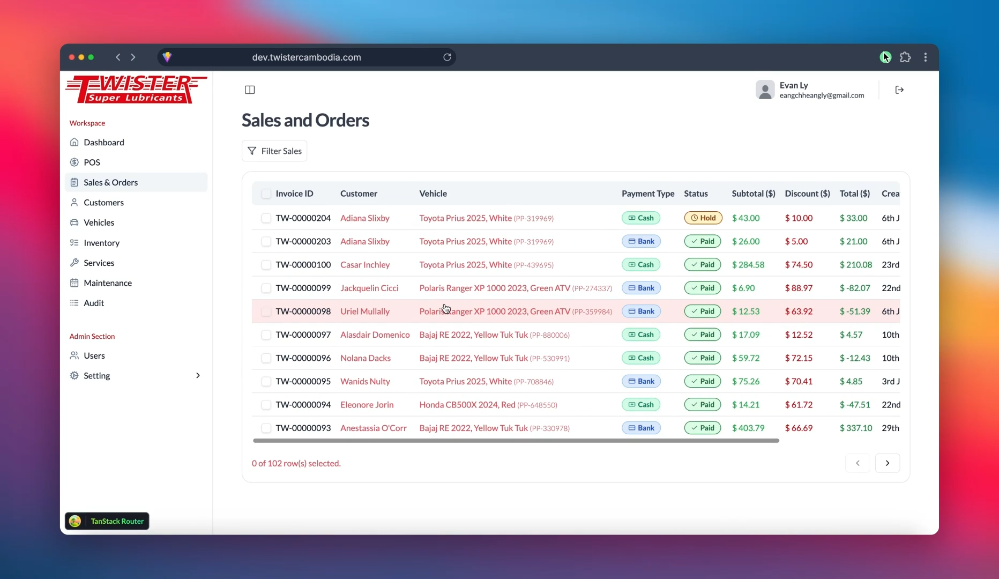

# Karas Frontend
Frontend application for the Karas ERP/POS system designed for auto service businesses.

## Preview

### Demo Video
<video width="100%" controls>
  <source src="assets/demo.mp4" type="video/mp4">
  Your browser does not support the video tag.
</video>

### Screenshots


## Demo
🔗 **Live Demo**: [dev.twistercambodia.com](https://dev.twistercambodia.com)
- Username: `demo`
- Password: `password@demo`

## Getting Started
Follow the instructions below to run the app locally.

### Prerequisites
Make sure you have the following installed:
- [Node.js v17 or higher](https://nodejs.org/en/about/previous-releases)  
- Latest version of [npm](https://www.npmjs.com/)

### Recommended Extensions
To maintain code quality and project standards, please use these VS Code extensions:
- [Tailwind Sorter](https://marketplace.visualstudio.com/items?itemName=dejmedus.tailwind-sorter)  
- [ESLint](https://marketplace.visualstudio.com/items?itemName=dbaeumer.vscode-eslint)

### Installation
Clone the repository and install dependencies:
```bash
git clone git@github.com:Indraneers/karas-frontend.git
cd karas-frontend
npm install
```

### Environment Variables
Create a .env file using .env.example as a template and configure the following variables:
```env
# Frontend port
PORT=5173
# Backend API URL
VITE_BACKEND_API_URL=
# Keycloak Authentication URL
VITE_KEYCLOAK_URL=
# MinIO storage URL and bucket info
VITE_MINIO_URL=
VITE_BUCKET_NAME=
# OAuth2 Client ID and authority URL
VITE_CLIENT_ID=
VITE_AUTHORITY=
# Show development tools toggle (true/false)
VITE_SHOW_DEV_TOOLS=
```

### Running the app locally
To start a local server, run
```bash
npm run dev
```

## Roadmap

- [ ] **Note taking for vehicles and customers** - Track service history and important details
- [ ] **Telegram integration** - Automated maintenance reminders for customers  
- [ ] **Stock analytics** - Inventory management with turnover rates and reorder alerts
- [ ] **Elasticsearch for sales** - Advanced search and analytics for sales data
- [ ] **AI spare parts lookup** - Smart system for finding parts and technical details